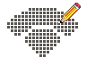
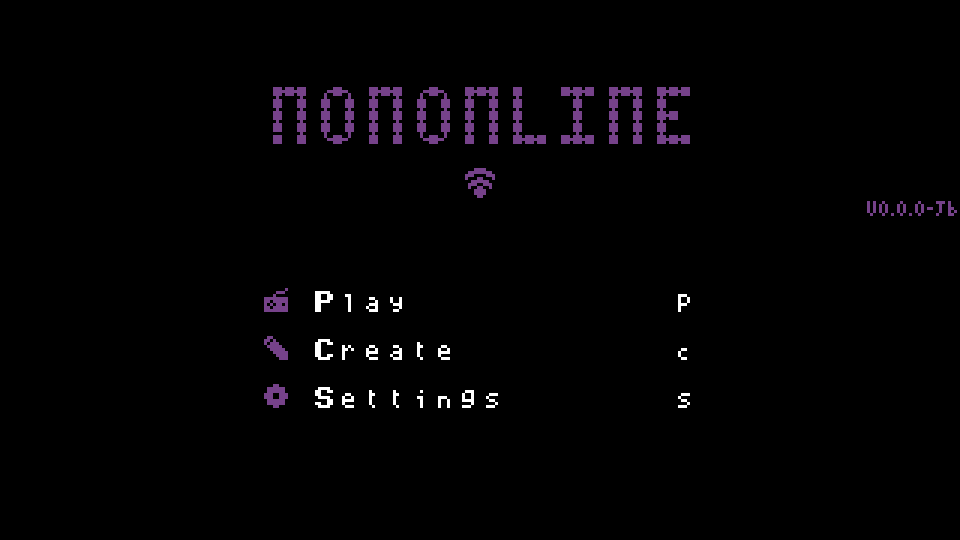
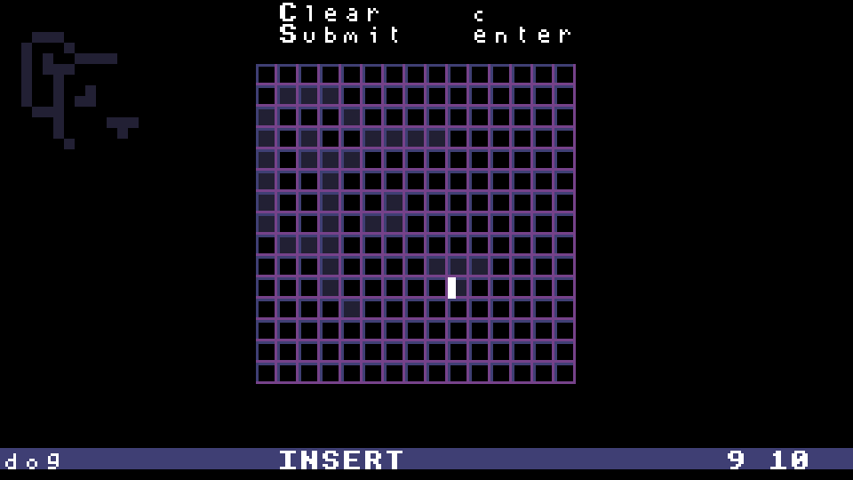
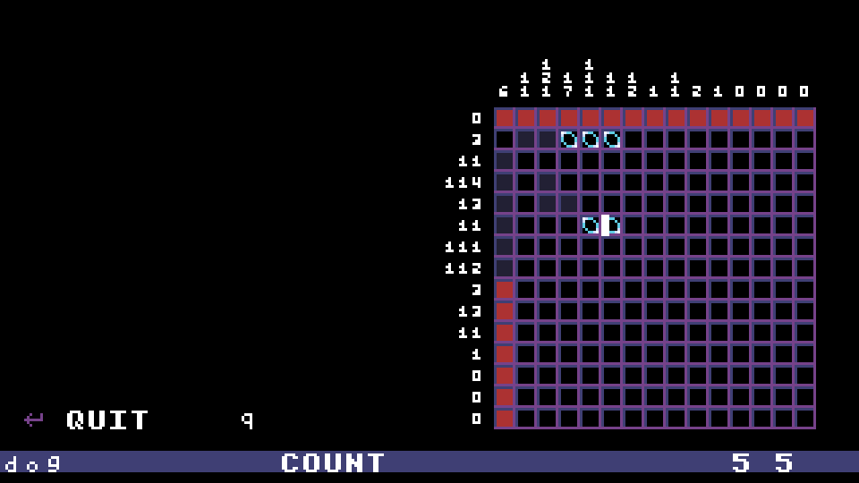
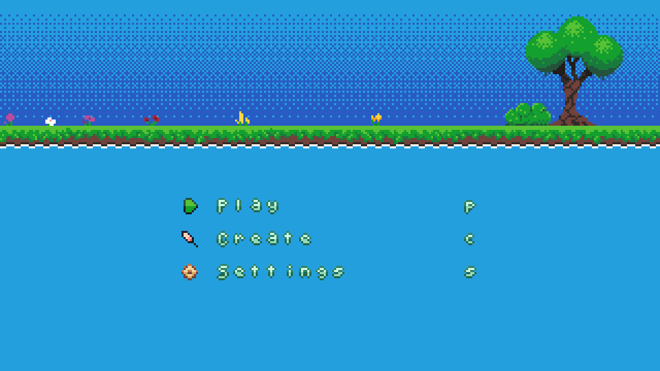
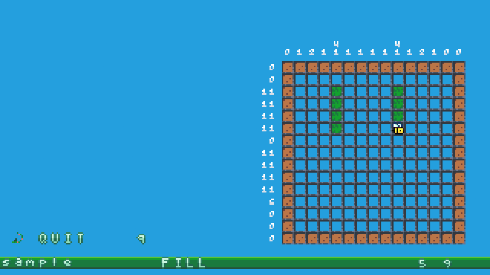
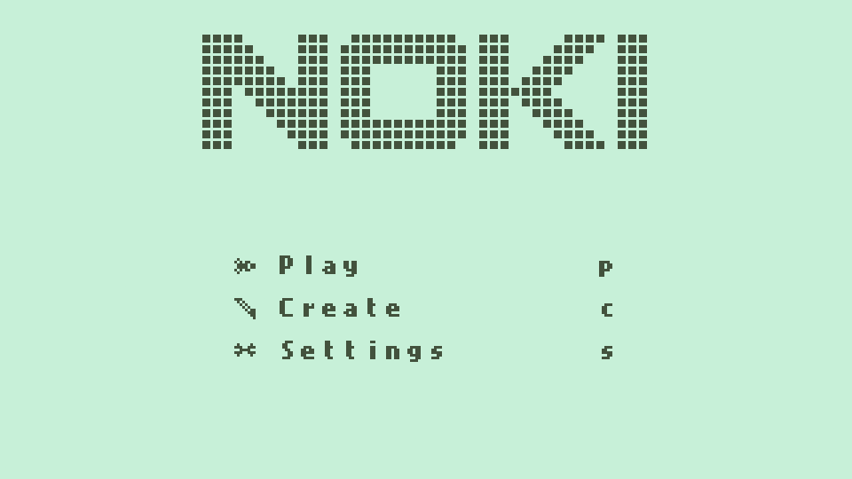
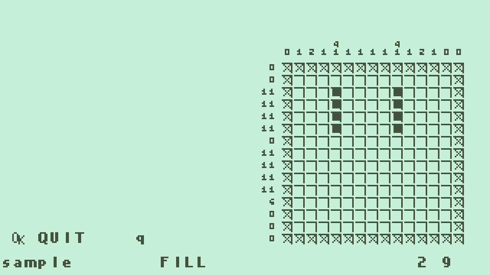
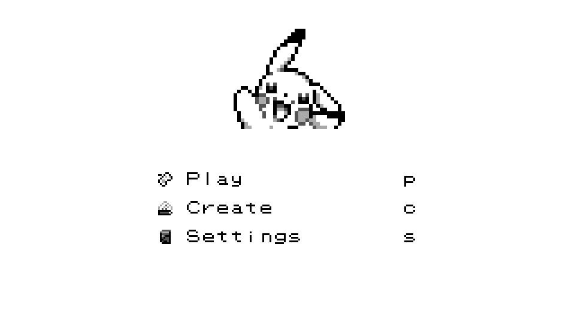
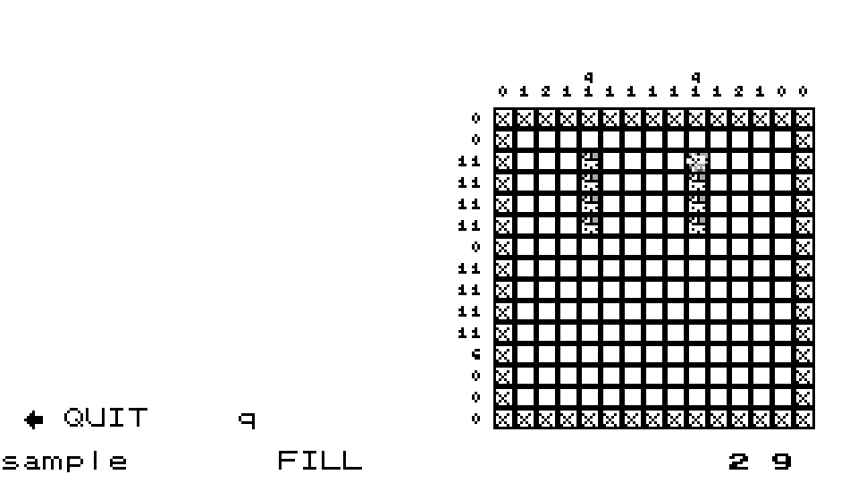

 

  

  <h3>Nononline</h3>

  

    Create, upload, and play Nonograms created by you and your community.
  

  
  
  

## Technologies used
- [Express](https://expressjs.com/) minimalist web framework for Node.js
- [Node.js](https://nodejs.org/en) JavaScript runtime environment
- [SQLite](https://sqlite.org/) self-contained SQL database engine
- [Vite](https://vite.dev/) frontend build tool
- [Yarn](https://yarnpkg.com/) JavaScript package manager

## Running Locally
### Server
> [!WARNING]
> The game is unplayable without a server. An offline version is planned to be produced

1. In a command line, navigate to the `server` directory of this project
1. Run `npm start` to start the server

### Client
1. In a command line, navigate to the `client` directory of this project
1. Run `yarn dev` to start a development server
1. You should get a link (e.g. `http://localhost:5173/`) you can connect to to start playing

- To connect to an external server, change the link in [Game.js line 39](../client/src/game/Game.js)

## Controls
### Movement
- <kbd>arrow keys</kbd> move cursor
- <kbd>h</kbd> move cursor left
- <kbd>l</kbd> move cursor right
- <kbd>j</kbd> move cursor down
- <kbd>k</kbd> move cursor up

### Modes
- <kbd>r</kbd> count mode
- <kbd>f</kbd> fill mode
- <kbd>c</kbd> cross mode

### Drawing
- <kbd>spacebar</kbd> draw
- <kbd>;</kbd> erase

# Themes showcase
## Included themes

  <h3>default</h3>

| Menu | Gameplay |
| --- | --- |
|  |  |

  <h3>forest</h3>

| Menu | Gameplay |
| --- | --- |
|  |  |

  <h3>noki</h3>

| Menu | Gameplay |
| --- | --- |
|  |  |

  <h3>pokichu</h3>

| Menu | Gameplay |
| --- | --- |
|  |  |

## Community themes

- Refer to [the wiki]() to get instructions on how to make your own themes

(<a href="#readme-top">Back to top</a>)
